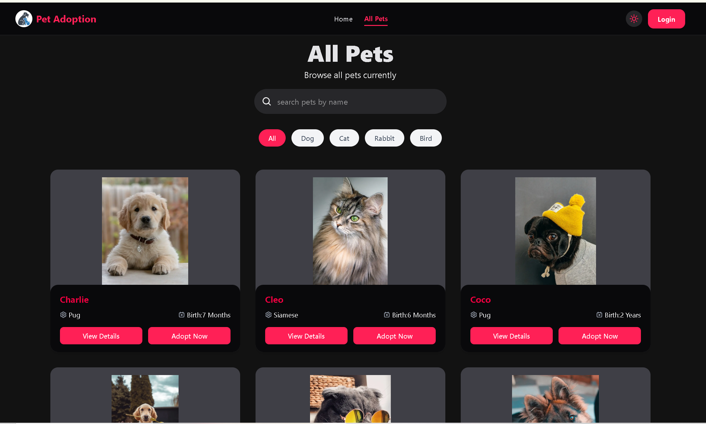
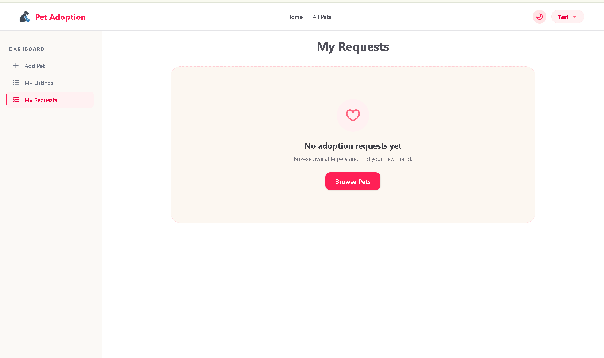

# Pet Adoption Platform (Client)
A modern web platform where users can browse, list, and adopt pets easily.

---

## Table of Contents
- [About the Project](#about-the-project)
- [Project Overview](#project-overview)
- [Key Features](#key-features)
- [Tech Stack](#tech-stack)
- [Dependencies](#dependencies)
- [Installation & Setup](#installation--setup)
- [Folder Structure](#folder-structure)
- [Contributions](#contributions)
- [How to Contribute](#how-to-contribute)
- [License](#license)
- [Contact](#contact)

---

## About the Project
Pet Adoption Platform is a client-side web application built to connect pet lovers with pets that need a home. It provides a clean interface for browsing available pets, viewing details, and going through an adoption/authentication flow.

---

## Project Overview
The goal of this project is to make pet adoption simple and accessible online — replacing scattered listings with a single, easy-to-use platform. It focuses on a smooth authentication experience, a responsive UI, and a pleasant browsing experience for pet listings.



---

## Key Features
- Secure Authentication (via Better Auth)
- Responsive, modern UI built with HeroUI components
- Smooth animations and transitions
- Light/Dark theme support
- Toast notifications for user feedback
- Icon-driven, clean design (React Icons)
- User dashboard with adoption request tracking



---

## Tech Stack
**Frontend:** Next.js 16 · React 19 · Tailwind CSS 4 · HeroUI
**Backend / Data:** MongoDB
**Auth:** Better Auth
**Other Tools:** Motion (animations) · Next Themes · React Icons · React Toastify

---

## Dependencies
```json
{
  "dependencies": {
    "@heroui/react": "^3.2.2",
    "@heroui/styles": "^3.2.2",
    "better-auth": "^1.6.18",
    "mongodb": "^7.3.0",
    "motion": "^12.42.2",
    "next": "16.2.9",
    "next-themes": "^0.4.6",
    "react": "19.2.4",
    "react-dom": "19.2.4",
    "react-icons": "^5.7.0",
    "react-toastify": "^11.1.0"
  }
}
```

---

## Installation & Setup
1. Clone the repo and install dependencies:
```bash
git clone https://github.com/rupa3670/pet-adoption-platform-client.git
cd pet-adoption-platform-client
npm install
```
2. Set up environment variables by creating a `.env` file in the root directory:
```env
DATABASE_URL=your_mongodb_connection_string
BETTER_AUTH_SECRET=your_auth_secret
```
3. Run the application:
```bash
npm run dev
```
Open http://localhost:3000 to view it in the browser.

---

## Folder Structure
```plaintext
pet-adoption-platform-client/
│
├── public/
├── src/
│   ├── app/
│   ├── components/
│   └── lib/
├── package.json
└── next.config.mjs
```

---

## Contributions
Solo project — built and maintained by Rupali Akter.

---

## How to Contribute
- Fork the Project
- Create a branch (`git checkout -b feature/AmazingFeature`)
- Commit changes (`git commit -m 'Add some AmazingFeature'`)
- Push the branch (`git push origin feature/AmazingFeature`)
- Open a Pull Request

---

## License
Distributed under the MIT License. See `LICENSE.txt` for more information.

---

## Contact
**Live URL:** [Pet Adoption Platform](https://pet-adoption-platform-client-six.vercel.app/)
**Email:** [srrupaliakter@gmail.com](mailto:srrupaliakter@gmail.com)
**GitHub:** [rupa3670](https://github.com/rupa3670)